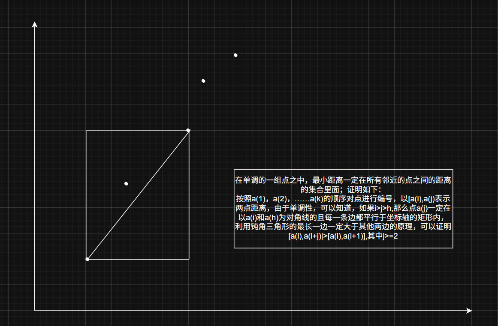
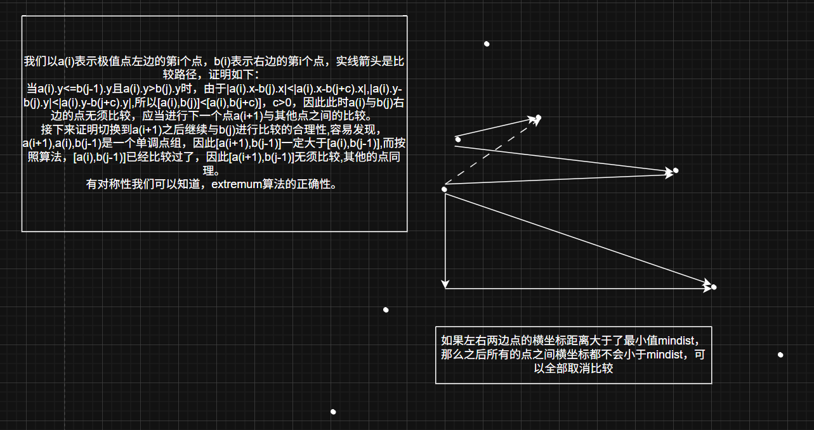

# Fastest-Closest-Pair
平面最近点对问题 —— 原创极值分段算法

## 算法简介
本算法基于**极点（山峰/山谷）分段**思想，是一种**非递归、超高速、常数极小**的最近点对求解算法：
1. 对点按 x 坐标排序
2. 根据 y 的单调性将点集划分为多个单调段
3. 单调段内仅比较相邻点
4. 极点附近做局部跨段比较
5. 滑动窗口保证全局正确性
6. 全程无递归，速度远超传统分治法

## 算法原理与正确性
1. 点按 x 坐标升序排列。
2. 根据 y 的上升/下降趋势，将序列划分为**单调段**，分段点为**极点（峰值/谷值）**。
3. **单调段内**：最小距离一定出现在相邻点之间，只需线性遍历。
4. **极点附近**：仅需局部检查，即可覆盖跨段最近点对。
5. **滑动窗口**：对远距离分段进行剪枝检查，确保 100% 正确且无冗余计算。
6. 所有可能的最近点对均被覆盖，结果严格正确。




## 时间复杂度
- 排序：O(n log n)
- 分段 + 段内遍历：O(n)
- 极点检查 + 滑动窗口：O(n)
- **整体复杂度：O(n log n)**
- **实际运行效率：远优于标准分治法**

## 核心函数说明
- `extremum()`：极点（峰值/谷值）附近跨段点对检查
- `checkSegments()`：滑动窗口全局剪枝，保证正确性
- `findClosestPair()`：算法主入口

## 运行环境
- 操作系统：Windows
- C++ 标准：C++11 及以上
- 编译器：MSVC
- **无任何第三方库依赖**

## 使用方法
输入点的数量 n，程序自动生成随机点并计算最小点对距离。

## 完整代码
```cpp
#include <iostream>
#include <vector>
#include <algorithm>
#include <cmath>
#include <chrono>
#include <random>

using namespace std;
using namespace chrono;

struct Point {
    float x, y;

    void setXY(float x_, float y_) {
        x = x_;
        y = y_;
    }

    float getDist(const Point& other) const {
        float dx = x - other.x;
        float dy = y - other.y;
        return sqrt(dx * dx + dy * dy);
    }
};

bool cmpx(const Point& a, const Point& b) {
    return a.x < b.x;
}

// 极点（峰值/谷值）跨段检查
void extremum(const vector<Point>& points, int left, int sl, int sr, int right, float& minDist, bool isUpward) {
	int j = sr;
	for (int i = sl; i >= left; i--) {
		if (j > right || points[i].x - points[j].x > minDist)
			break;
		minDist = min(minDist, points[i].getDist(points[j]));
		if (isUpward) {
			if (points[i].y > points[j].y) continue;
		}
		else if (points[i].y < points[j].y) continue;
		j++;
	}
}

// 滑动窗口全局检查（远距离分段剪枝）
void checkSegments(const vector<Point>& points, const vector<int>& segIndex, float& minDist, bool isPeak) {
	int start = 0, end = 1, checkIdx = 2;
	int segNum = segIndex.size() - 1;

	while (checkIdx < segNum) {
		while (checkIdx < segNum && points[segIndex[checkIdx]].x - points[segIndex[end]].x < minDist) {
			bool flag1 = (checkIdx % 2) ? !isPeak : isPeak;
			for (int i = start; i < end; i++) {
				bool flag = (i % 2) ? !isPeak : isPeak;
				if (flag != flag1)
					extremum(points, segIndex[i], segIndex[i + 1], segIndex[checkIdx], segIndex[checkIdx + 1], minDist, isPeak);
				else
					for (int j = segIndex[i]; j <= segIndex[i + 1]; j++)
						for (int k = segIndex[checkIdx]; k <= segIndex[checkIdx + 1]; k++)
							if (abs(points[k].y - points[j].y) < minDist)
								minDist = min(minDist, points[j].getDist(points[k]));
			}
			checkIdx++;
		}
		while (checkIdx < segNum && points[segIndex[checkIdx]].x - points[segIndex[end]].x >= minDist)
			if (++end == checkIdx)
				checkIdx++;
		while (start < end - 1 && points[segIndex[end]].x - points[segIndex[start]].x > minDist)
			start++;
	}
}

// 主函数：极值分段法求最近点对
float findClosestPair(vector<Point> points) {
	vector<int> segIndex(1, 0);
	float minDist = 1e10;
	int n = points.size();
	if (n <= 1) return 0x7F800000;
	if (n == 2) return points[0].getDist(points[1]);

	sort(points.begin(), points.end(), cmpx);

	bool isRising = points[0].y < points[1].y, isPeak = !isRising, nextFalling;
	for (int i = 1; i < n - 1; i++) {
		if (minDist > points[i].x - points[i - 1].x)
			minDist = min(minDist, points[i].getDist(points[i - 1]));
		nextFalling = points[i].y > points[i + 1].y;
		if (nextFalling == isRising) {
			segIndex.push_back(i);
			isRising = !isRising;
		}
	}
	minDist = min(minDist, points[n - 1].getDist(points[n - 2]));
	segIndex.push_back(n - 1);
	// 极点局部检查
    int segCount = segIndex.size();
	for (int i = 2; i < segCount; i++) {
		int peakPos = segIndex[i - 1];
		bool flag = (i % 2) ? !isPeak : isPeak;
		extremum(points, segIndex[i - 2], peakPos - 1, peakPos + 1, segIndex[i], minDist, flag);
	}
	// 全局滑动窗口检查
	checkSegments(points, segIndex, minDist, isPeak);
	return minDist;
}

mt19937 engine(high_resolution_clock::now().time_since_epoch().count());
uniform_real_distribution<float> dis(0, 1000000);

int main() {
    int n;
    float minDist;

    cout << "请输入点的数量：";
    cin >> n;

    vector<Point> points(n);
    for (int i = 0; i < n; i++)
        points[i].setXY(dis(engine), dis(engine));

    auto start = high_resolution_clock::now();
    minDist = findClosestPair(points);
    auto end = high_resolution_clock::now();

    cout << "最小距离为：" << minDist << "\n运行耗时："
        << duration_cast<milliseconds>(end - start).count() << " ms" << endl;

    return 0;
}
