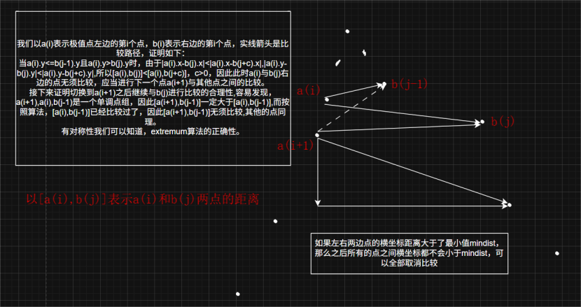
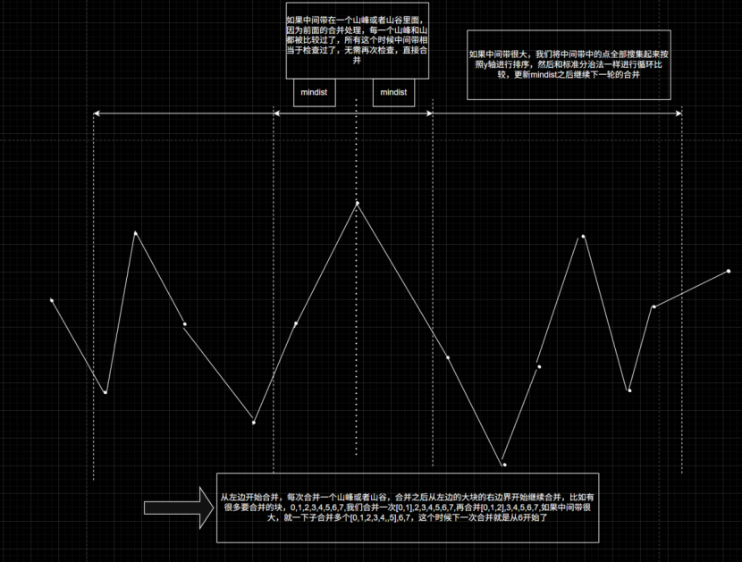
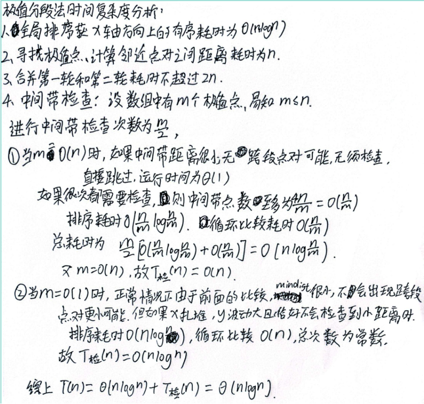

# Closest-Pair
平面最近点对问题 —— 原创 —— 极值分段算法

## 算法简介
本算法基于**极点（山峰/山谷）分段**思想，是一种**非递归**的最近点对求解算法：
1. 对点按 x 坐标排序
2. 根据 y 的单调性将点集划分为多个单调段
3. 单调段内仅比较相邻点
4. 极点附近做局部跨段比较
5. 合并阶段保证全局正确性
6. 如果存在重复点可以在n次查找之内退出函数返回结果0

## 算法原理与正确性
1. 点按 x 坐标升序排列。 点按 x 坐标升序排列。
2. 根据 y 的上升/下降趋势，将序列划分为**单调段**，分段点为**极点（峰值/谷值）**。
3. **单调段内**：最小距离一定出现在相邻点之间，只需线性遍历。
4. **极点附近**：仅需局部检查，即可覆盖跨段最近点对。
5.如果你发现有不正确之处，希望你能告诉我






## 时间复杂度
- 排序：O(n log n) 
- 分段 + 段内遍历 + 山峰山谷检查  
- **整体复杂度：O(n log n)**

## 核心函数说明
- `extremum()`：极点（峰值/谷值）附近跨段点对检查
- `findClosestPair()`：算法主入口

## 使用方法
输入点的数量 n，程序自动生成随机点并计算最小点对距离。

## 完整代码
```cpp
#include <iostream>
#include <vector>
#include <algorithm>
#include <cmath>
#include <chrono>
#include <random>

using namespace std;
using namespace chrono;

struct Point {
    double x, y;

    void setXY(double x_, double y_) {
        x = x_;
        y = y_;
    }

    double getDist(const Point& other) const {
        double dx = x - other.x;
        double dy = y - other.y;
        return sqrt(dx * dx + dy * dy);
    }
};

bool cmpx(const Point& a, const Point& b) {
    return a.x==b.x ? a.y < b.y:a.x < b.x;
}
//极值点跨段检查 
void extremum(const vector<Point>& points, int left, int mid, int right, double& minDist, bool isPeak) {
	int j = mid + 1;
	for (int i = mid - 1; i >= left; i--) {
		if (j > right || points[i].x - points[j].x > minDist) break;//x坐标相差太大了，不需要比较后面的了
		minDist = min(minDist, points[i].getDist(points[j]));
		if (isPeak) { if (points[i].y > points[j].y) continue; }
		else { if (points[i].y < points[j].y) continue; }
		j++; i++;//i不加的话，下一次循环进行就自动加减一了
	}
}
// 极值分段算法主函数
double findClosestPair(vector<Point> points) {
	//如果点数目很小，直接计算返回结果，不需要复杂的处理；
	int n = points.size();
	if (n <= 1) return numeric_limits<double>::infinity();
	if (n == 2) return points[0].getDist(points[1]);
	//按照x进行排序，形成天然的单调段，同时方便从左到右进行线性处理；
	// 数组的左右边界的点也算极值点，其中左边界的点算是第0个极值点；
	//对于每个单调段，我们以其最左边的极值点在整个数组里面是第几个作为他的编号；
	sort(points.begin(), points.end(), cmpx);
	vector<int> segIndex(1, 0);//用来保存每一个极值点在整个数组中的下标，数组左边界就是极值点，所以初始数据为0
	vector<double> segX(n);//用来保存对应极值点的x坐标
	segX[0] = points[0].x;
	vector<Point> strip(n);//中间带检查的数据存放数组，方便排序，提前分配后面的中间带检查所需要的空间，减少内存开销
	bool isBigThanLeft = points[0].y < points[1].y;//这个点比左边的点y坐标还要大吗？
	bool isBigThanRight;//这个点比他右边的点还要大吗？
	bool isPeak = isBigThanLeft;//编号为0的单调段是下降的还是上升的？
	double minDist = 0x7FFF0000;//最小值
	//寻找极值点并且顺便进行单调区间的检查和初步的合并
	for (int i = 1; i < n - 1; i++) {
		// 相邻点距离更新
		double d = points[i].getDist(points[i - 1]);
		if (d < minDist) minDist = d;
		if (minDist == 0) return 0;//如果有重复点，直接退出，返回值为0
		isBigThanRight = points[i].y > points[i + 1].y;
		isBigThanLeft = points[i].y > points[i - 1].y;
		if (isBigThanLeft == isBigThanRight) {//如果一个点不大于两边的点或者不小于两边的点，那么他就是一个极值点
			segIndex.push_back(i);//记录极值点在所有点集中的下标，同时这样子极值点在segIndex对应的下标就是极值点的编号
			segX[segIndex.size() - 1] = points[i].x;//记录极值点的x坐标
			// 当有足够边界时，立即调用 extremum 检查以当前极值点为右边界的前一段
			if (segIndex.size() >= 3) {
				int k = segIndex.size() - 1;           //告诉extremum函数这个是山峰还是山谷
				bool flag = (k % 2) ? !isPeak : isPeak;//如果是偶数下标，说明他与第一个单调段相同的趋势
				extremum(points, segIndex[k - 2], segIndex[k - 1], segIndex[k], minDist, flag);
			}
		}
	}
	// 因为我们的循环到n-1就结束了，还有最后一个点要处理
	double d = points[n - 1].getDist(points[n - 2]);
	if (d < minDist) minDist = d;
	segIndex.push_back(n - 1);
	segX[segIndex.size() - 1] = points[n - 1].x;
	if (segIndex.size() >= 3) {
		int k = segIndex.size() - 1;
		bool flag = (k % 2) ? !isPeak : isPeak;
		extremum(points, segIndex[k - 2], segIndex[k - 1], segIndex[k], minDist, flag);
	}
	//带状区域合并检查
	int segCount = segIndex.size();
	for (int i = 2; i < segCount - 1; ) {
		//偶数下标的极值点都是合并的时候的合并位置，所以要以他们作为中间带的标准进行划分中间带
		double midX = segX[i];
		int L = lower_bound(segX.begin(), segX.begin() + segCount, midX - minDist) - segX.begin() - 1;
		int R = upper_bound(segX.begin(), segX.begin() + segCount, midX + minDist) - segX.begin() - 1;
		L = max(0, min(L, segCount - 1));//防止越界
		R = min(R, segCount - 2);//防止越界

		if (L < i - 1 || R > i) {//如果中间带在同一个山峰或者山谷里面，直接跳过，不需要处理
			int start = segIndex[L];
			int end = segIndex[R + 1];
			strip.clear();
			for (int k = start; k <= end; k++)
				strip.emplace_back(points[k]);//不使用push_back，提高性能
			//下面的逻辑与标准分治法一样
			sort(strip.begin(), strip.end(), cmpy);
			int sz = strip.size();
			for (int a = 0; a < sz; a++) {
				for (int b = a + 1; b < sz && strip[b].y - strip[a].y < minDist; b++) {
					double d = strip[a].getDist(strip[b]);
					if (d < minDist) minDist = d;
				}
			}
		}
		//跳步逻辑，减少无效比较
		if (R <= i + 2) i += 2;
		else i = (R % 2 == 0) ? R : R - 1;//保证是i指向的是合并的位置，也就是偶数下标
	}
	return minDist;
}

mt19937 engine(high_resolution_clock::now().time_since_epoch().count());
uniform_real_distribution<float> dis(0, 1000000);

int main() {
    int n;
    float minDist;

    cout << "请输入点的数量：";
    cin >> n;

    vector<Point> points(n);
    for (int i = 0; i < n; i++)
        points[i].setXY(dis(engine), dis(engine));

    auto start = high_resolution_clock::now();
    minDist = findClosestPair(points);
    auto end = high_resolution_clock::now();

    cout << "最小距离为：" << minDist << "\n运行耗时："
        << duration_cast<milliseconds>(end - start).count() << " ms" << endl;

    return 0;
}
